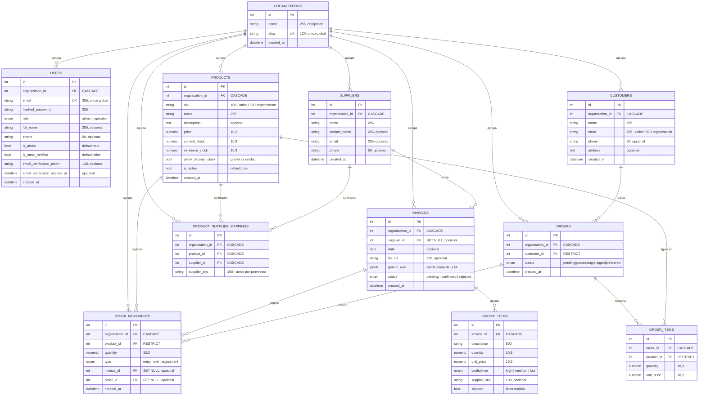

# Diagrama Entidad-Relación (DER) — StockFlow CRM

Modelo de datos actual, derivado directamente de los modelos SQLAlchemy
(`backend/app/models/`) y de las migraciones de Alembic. **12 tablas**
(11 de negocio + `alembic_version`).

> 📌 Este diagrama está en formato **Mermaid**: GitHub lo renderiza solo, y se
> puede exportar a PNG/SVG pegándolo en [mermaid.live](https://mermaid.live).
> Reemplaza al `DER.png` anterior, que no incluía el multi-tenant.

---

## Diagrama

---

## Decisiones de diseño

### Multi-tenancy: `organizations` como raíz de aislamiento

`organizations` es la tabla central del aislamiento. **Las 8 tablas de negocio
llevan `organization_id`** con borrado en cascada: al eliminar una organización
se van todos sus datos. Cada consulta de la API filtra por la organización del
usuario autenticado, de modo que dos empresas nunca ven datos de la otra.

### Unicidad: global vs. por organización

| Campo | Alcance | Motivo |
|---|---|---|
| `users.email` | **Global** | El login no está segmentado: con el correo alcanza para resolver a qué organización pertenece el usuario. |
| `organizations.slug` | **Global** | Identificador legible único del sistema. |
| `products.sku` | **Por organización** (`uq_product_org_sku`) | Dos empresas distintas pueden usar el mismo SKU legítimamente. |
| `customers.email` | **Por organización** (`uq_customer_org_email`) | Un mismo cliente puede comprarle a varias empresas del sistema. |
| `product_supplier_mappings.supplier_sku` | **Por proveedor** (`uq_supplier_sku`) | El SKU del proveedor es único dentro de ese proveedor. |

### Políticas de borrado (`ON DELETE`)

- **CASCADE** — datos que no tienen sentido sin su padre: todo lo que cuelga de
  `organizations`, los ítems de un pedido o de una factura, y los mapeos.
- **RESTRICT** — protege la integridad histórica: no se puede borrar un producto
  que figura en pedidos o movimientos, ni un cliente con pedidos.
- **SET NULL** — el registro sobrevive perdiendo la referencia: un movimiento de
  stock conserva su historial aunque se borre la factura o el pedido que lo
  originó.

### Precisión numérica

- `price` y `unit_price`: `Numeric(10,2)` — importes monetarios.
- Cantidades y stock: `Numeric(10,3)` — admite hasta 3 decimales para artículos
  a granel (kilos, litros, metros). El flag `allow_decimal_stock` de cada
  producto define si acepta fracciones: los productos por unidad rechazan
  cantidades decimales.

### Trazabilidad del stock

`stock_movements` es el libro mayor del inventario. Cada fila indica **de dónde
vino el cambio** mediante dos claves foráneas opcionales y excluyentes en la
práctica:

- `invoice_id` → entrada de mercadería (`type = entry`)
- `order_id` → salida por venta (`type = exit`)
- ambas nulas → ajuste manual (`type = adjustment`)

### Auditoría de la IA

`invoices.gemini_raw` (JSONB) guarda la **respuesta cruda de Gemini**. Permite
auditar qué extrajo el modelo, reprocesar una factura sin volver a llamar a la
IA, y comparar lo detectado contra lo que el usuario terminó corrigiendo.
`invoice_items.confidence` conserva el nivel de confianza por línea, y
`skipped` marca las líneas que el usuario decidió omitir.

---

## Cambios respecto del DER anterior

Si venís del `DER.png` original, esto es lo que cambió:

1. **Tabla nueva `organizations`** y `organization_id` en las 8 tablas de negocio.
2. **`users`** suma: `organization_id`, `full_name`, `phone`, `is_active`,
   `is_email_verified`, `email_verification_token` y
   `email_verification_expires_at`.
3. **`products`** suma `allow_decimal_stock` e `is_active`; `current_stock` y
   `minimum_stock` pasaron de enteros a `Numeric(10,3)`.
4. **`invoice_items`** suma `skipped`.
5. **Unicidad**: `products.sku` y `customers.email` dejaron de ser únicos
   globales y pasaron a ser únicos **por organización**.
