# Diagramas de Flujo — StockFlow CRM

Documento de procesos del sistema. Describe la **lógica de cada proceso**: los
pasos, las decisiones, las validaciones y los caminos alternativos.

> 📌 Los diagramas están en formato **Mermaid**: GitHub los renderiza
> automáticamente y se pueden exportar a PNG/SVG pegándolos en
> [mermaid.live](https://mermaid.live).

## Índice

1. [Autenticación y acceso](#1-autenticación-y-acceso)
   - 1.1 [Registro de una organización](#11-registro-de-una-organización)
   - 1.2 [Verificación del correo electrónico](#12-verificación-del-correo-electrónico)
   - 1.3 [Inicio de sesión](#13-inicio-de-sesión)
2. [Procesamiento de facturas con IA](#2-procesamiento-de-facturas-con-ia)
3. [ABM de Proveedores](#3-abm-de-proveedores)
4. [ABM de Clientes](#4-abm-de-clientes)
5. [ABM de Productos](#5-abm-de-productos)
6. [Gestión de pedidos](#6-gestión-de-pedidos)
7. [Gestión de usuarios del equipo](#7-gestión-de-usuarios-del-equipo)
8. [Flujos de trabajo integrales](#8-flujos-de-trabajo-integrales)

### Convenciones

| Símbolo | Significado |
|---|---|
| Óvalo | Inicio o fin del proceso |
| Rectángulo | Acción o proceso |
| Rombo | Decisión / validación |
| Cilindro | Persistencia en la base de datos |

---

## 1. Autenticación y acceso

### 1.1 Registro de una organización

Alta pública del sistema. Cada registro crea una organización independiente y
deja a su autor como administrador.

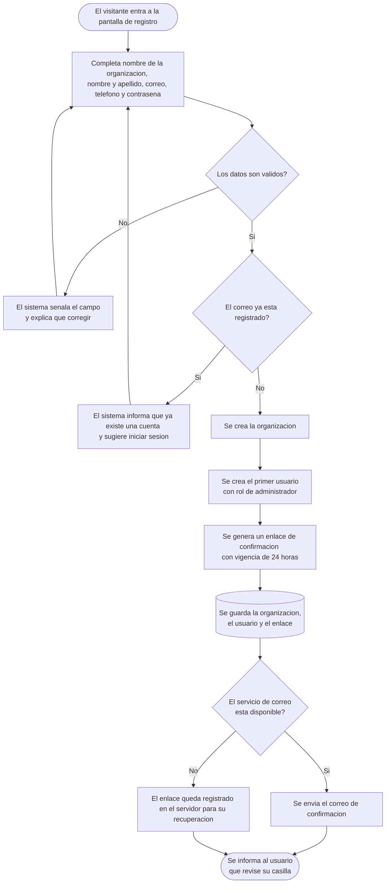

### 1.2 Verificación del correo electrónico

Paso obligatorio: hasta completarlo, la cuenta no puede operar.

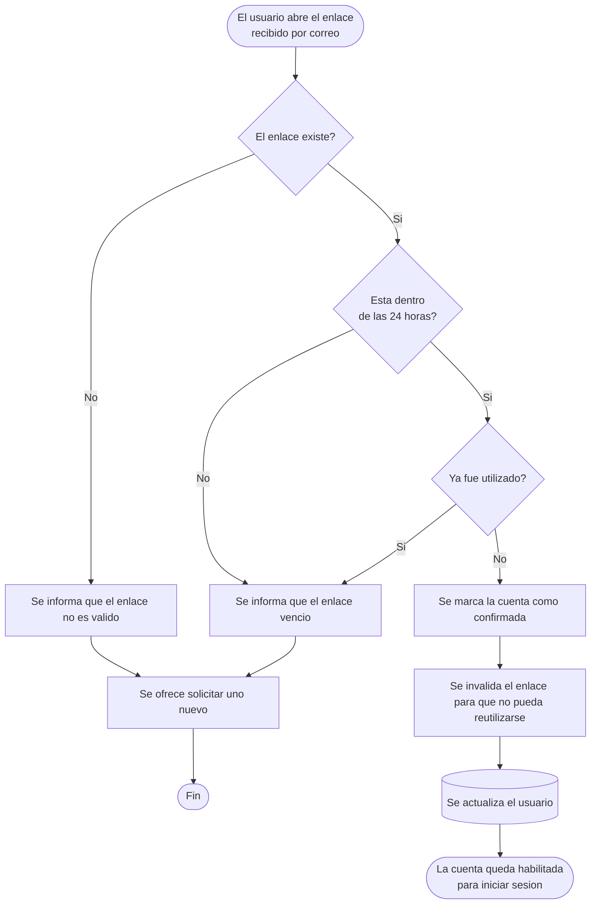

### 1.3 Inicio de sesión

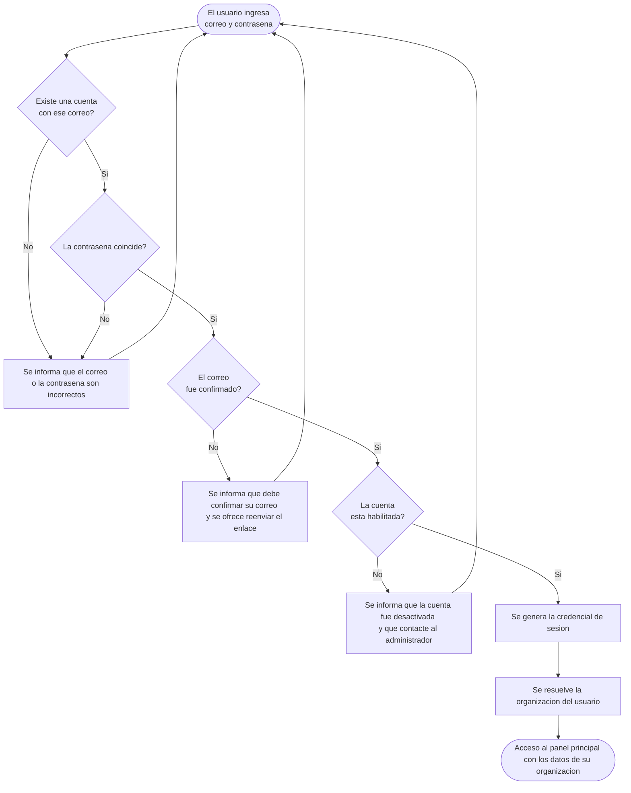

---

## 2. Procesamiento de facturas con IA

Proceso central del sistema. La inteligencia artificial **asiste** la carga, pero
la revisión humana es obligatoria: nada modifica el inventario sin confirmación
explícita del usuario.

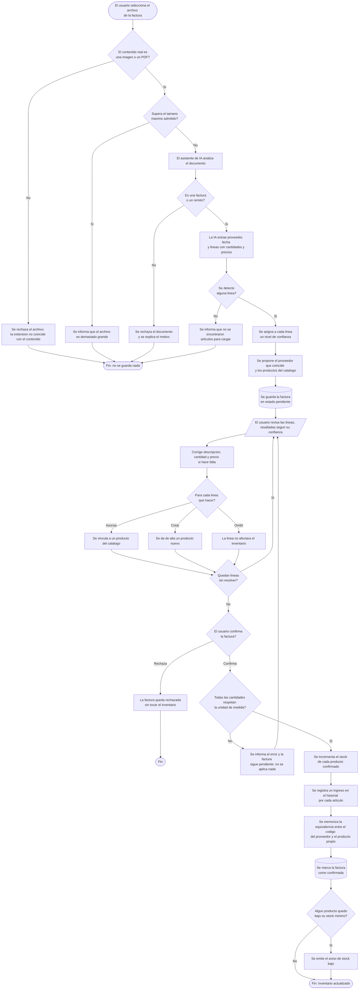

> **Nota sobre la atomicidad.** La confirmación es *todo o nada*: si falla
> cualquier línea, no se aplica ningún cambio y la factura permanece pendiente.
> Así se evita que el inventario quede a medio actualizar.

---

## 3. ABM de Proveedores

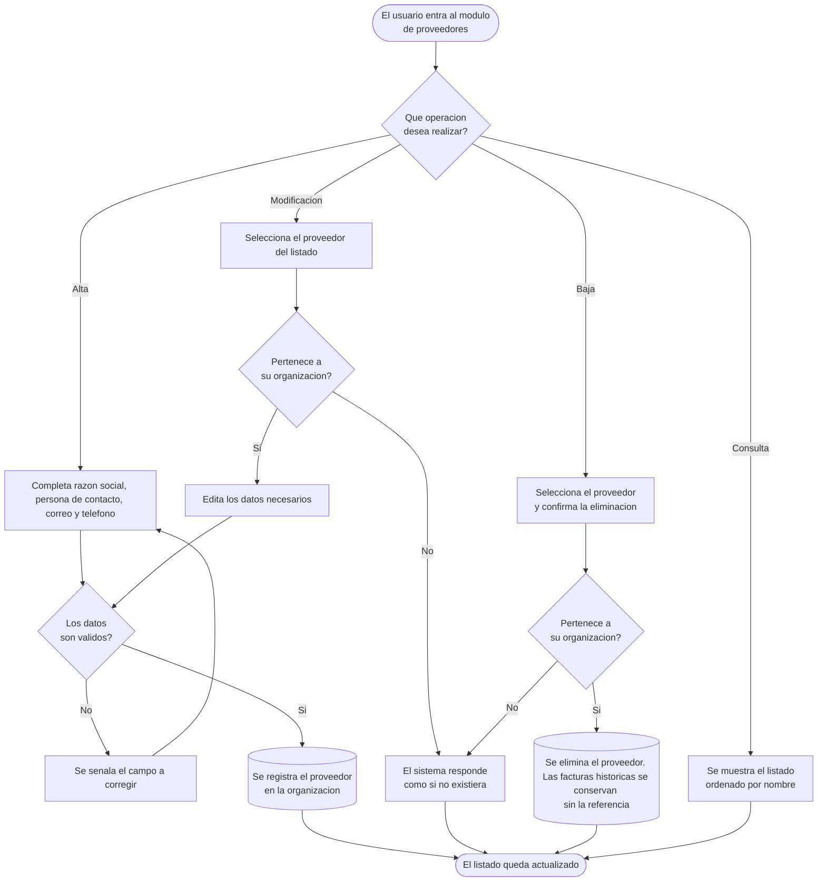

> **Nota.** Al eliminar un proveedor, las facturas que lo referenciaban se
> conservan pero pierden la referencia. Se prioriza no perder el historial de
> compras.

---

## 4. ABM de Clientes

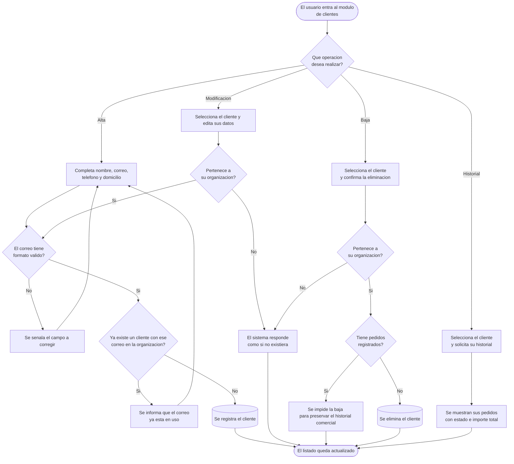

> **Nota.** El correo del cliente es único **dentro de cada organización**: dos
> empresas distintas pueden tener registrado al mismo cliente.

---

## 5. ABM de Productos

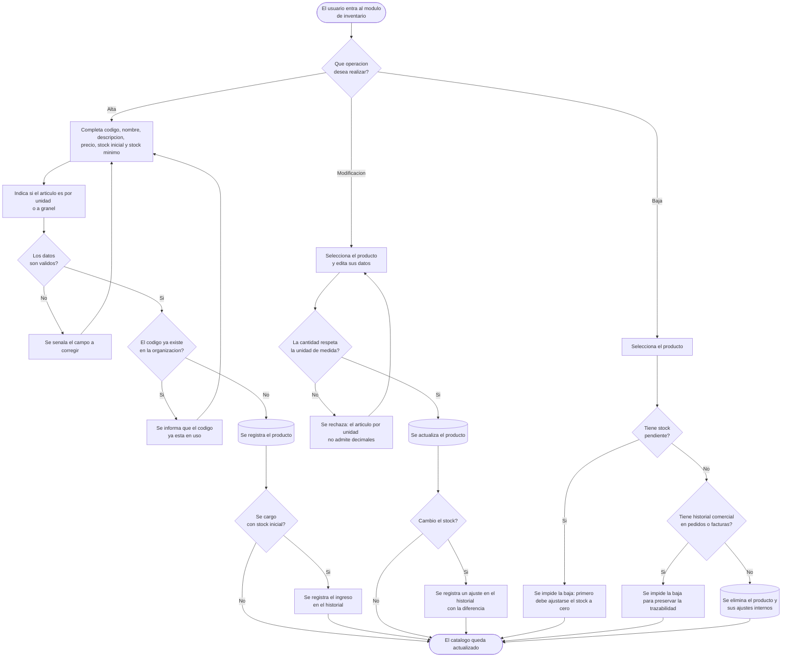

---

## 6. Gestión de pedidos

El stock se descuenta **al comenzar la preparación**, no al crear el pedido.

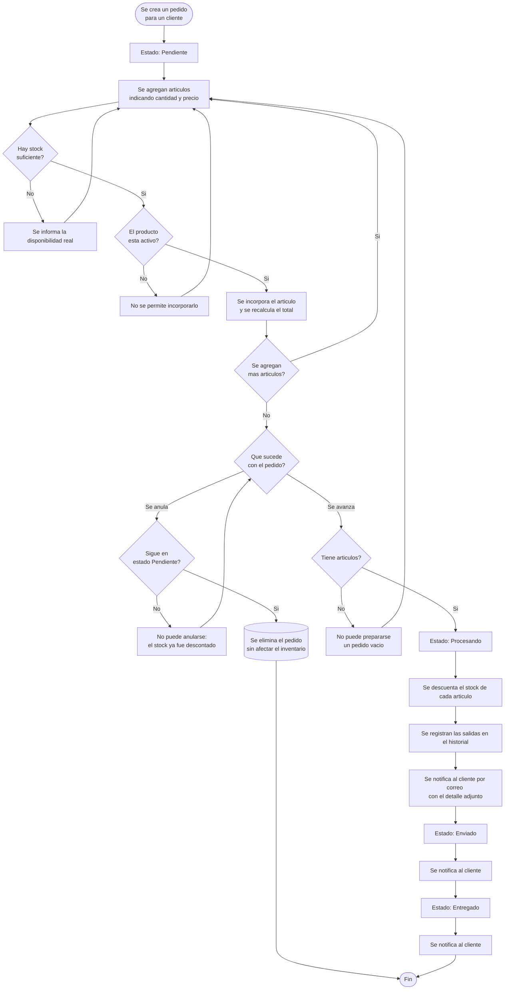

---

## 7. Gestión de usuarios del equipo

Proceso exclusivo del administrador.

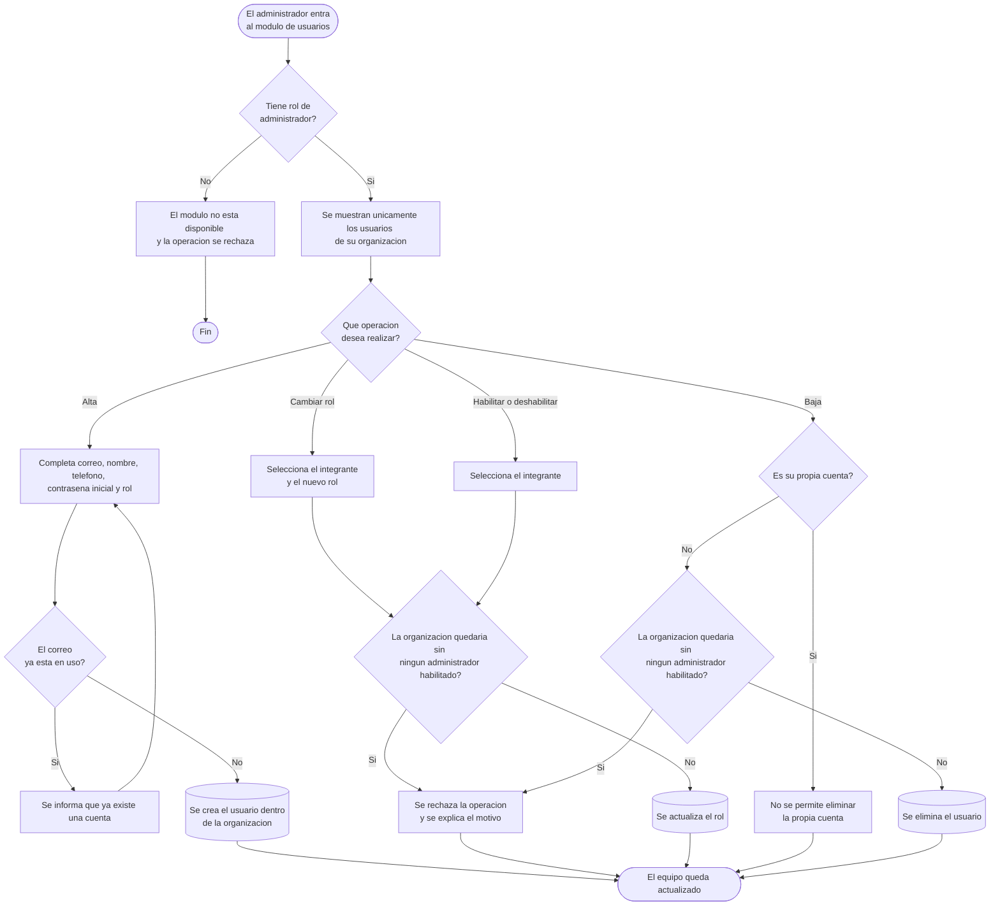

---

## 8. Flujos de trabajo integrales

Procesos operativos completos que atraviesan varios módulos del sistema.

### 8.1 Recepción de mercadería con factura

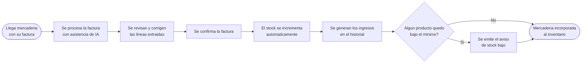

### 8.2 Atención de un pedido de cliente

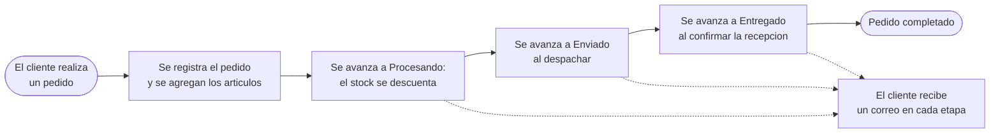

### 8.3 Alta de un producto nuevo desde una factura

Cuando la IA detecta un artículo que todavía no existe en el catálogo.

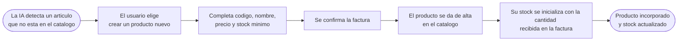

---

## Trazabilidad con los casos de uso

| Proceso | Casos de uso relacionados |
|---|---|
| 1.1 Registro de una organización | UC-20 |
| 1.2 Verificación del correo | UC-21, UC-22 |
| 1.3 Inicio de sesión | UC-01, UC-02, UC-03 |
| 2. Facturas con IA | UC-09, UC-25, UC-26, UC-10, UC-11 |
| 3. ABM de Proveedores | UC-07, UC-08 |
| 4. ABM de Clientes | UC-12, UC-13 |
| 5. ABM de Productos | UC-04, UC-05, UC-06, UC-24 |
| 6. Gestión de pedidos | UC-14, UC-15, UC-16, UC-17 |
| 7. Gestión de usuarios | UC-23 |
| Transversal a todos | UC-28 (aislamiento entre organizaciones) |
